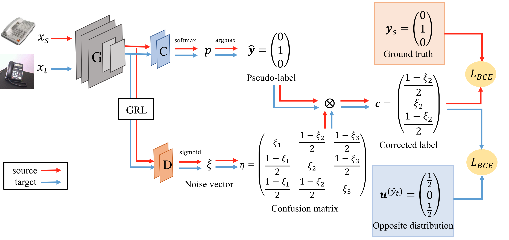
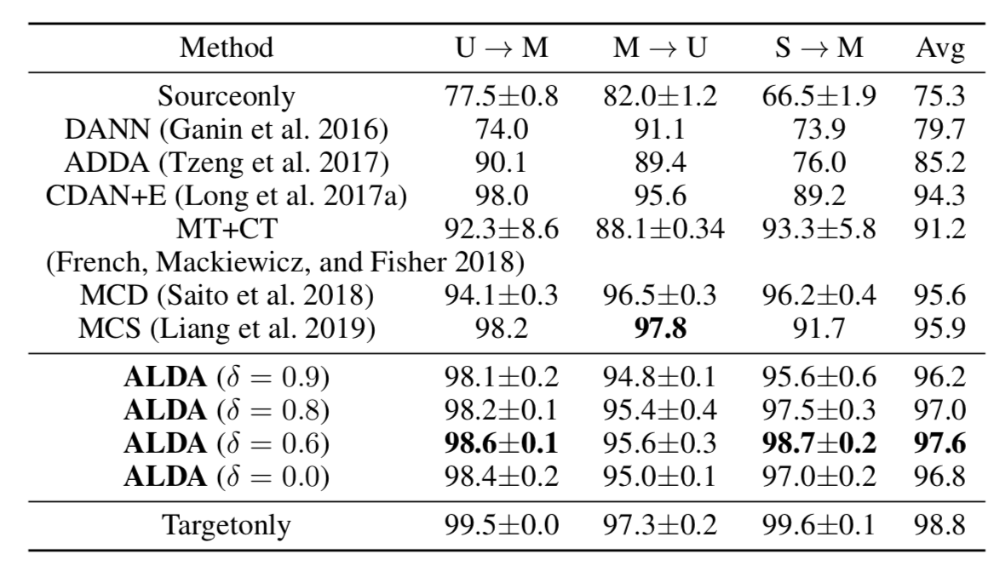
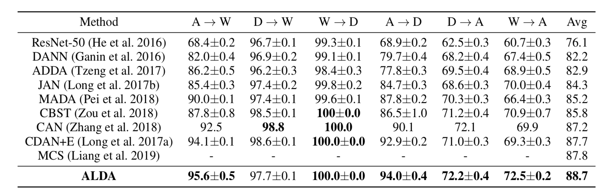

# Adversarial-Learned Loss for Domain Adaptation

By Minghao Chen, Shuai Zhao, Haifeng Liu, Deng Cai.

## Introduction

A **PyTorch** implementation for our **AAAI 2020** paper **["Adversarial-Learned Loss for Domain Adaptation" (ALDA)](https://arxiv.org/abs/2001.01046)**.  In ALDA, we use a domain discriminator to correct the noise in the pseudo-label. ALDA outperforms state-of-the-art approaches in four standard unsupervised domain adaptation datasets.



## Requirements

The code is implemented with Python(3.6) and Pytorch(1.0.0).

Install the newest Pytorch from https://pytorch.org/.

To install the required python packages, run

```python
pip install -r requirements.txt
```

## Setup

#### Digits：

Download [SVHN dataset](https://drive.google.com/file/d/1Y0wT_ElbDcnFxtu25MB74npURwwijEdT/view) and unzip it at `data/svhn2mnist`.

#### Office-31

Download [Office-31 dataset](https://people.eecs.berkeley.edu/~jhoffman/domainadapt/) and unzip it at `data/office`.

#### Office-Home

Download [Office-Home dataset](http://hemanthdv.org/OfficeHome-Dataset/) and unzip it at `data/office-home`.

#### VisDA-2017

Download [VisDA-2017 dataset](https://github.com/VisionLearningGroup/taskcv-2017-public/tree/master/classification)


## Training

#### Digits：

```
SVHN->MNIST
python train_svhnmnist.py ALDA --gpu_id 0 --epochs 50 --loss_type all --start_epoch 2 --threshold 0.6

USPS->MNIST
python train_uspsmnist.py ALDA --gpu_id 0 --epochs 50 --task USPS2MNIST --loss_type all --start_epoch 2 --threshold 0.6

MNIST->USPS
python train_uspsmnist.py ALDA --gpu_id 0 --epochs 50 --task MNIST2USPS --loss_type all --start_epoch 2 --threshold 0.6
```

#### Office-31:

```
Amazon->Webcam
python  train.py ALDA --gpu_id 0 --net ResNet50 --dset office --test_interval 500 --s_dset_path ./data/office/amazon_list.txt --t_dset_path ./data/office/webcam_list.txt --batch_size 36 --trade_off 1 --output_dir "A2W_ALDA_all_thresh=0.9_test" --loss_type all --threshold 0.9
```

We provide a shell file to train all six adaptation tasks at once.

```
sh train.sh
```

#### Office-Home

Train all twelve adaptation tasks at once:

```
sh train_home.sh
```

#### VisDA-2017

The code of VisDA-2017 dataset is still processing.


## Results

The code is tested on GTX 1080 with cuda-9.0.

The results presented in the paper:






## Citation

If you use this code in your research, please cite:

```
@article{chen2020adversariallearned,
    title={Adversarial-Learned Loss for Domain Adaptation},
    author={Minghao Chen and Shuai Zhao and Haifeng Liu and Deng Cai},
    journal={arXiv},
    year={2020},
    volume={abs/2001.01046}
}
```


## Acknowledgment

The structure of this code is largely based on [CDAN](https://github.com/thuml/CDAN). We are very grateful for their open source.